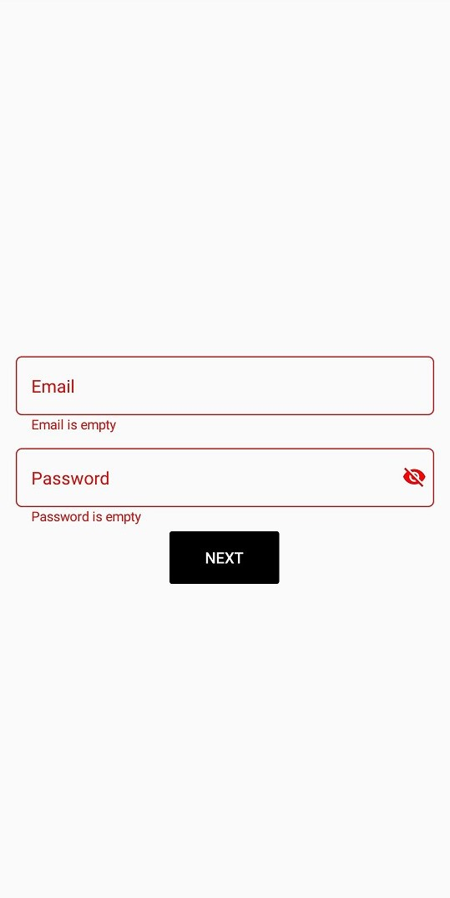

# How to validate with required verification in text input layout in Xamarin.Forms
This article explains How to validate with required verification in text input layout in Xamarin.Forms 

The SfTextInputLayout is Syncfusion UI component that helps to add decorative elements such as floating labels, icons, and assistive labels on the top of input views.

When developing applications, a good UX practice involves the application to provide feedback to the user when the input is empty or invalid.

In this article, we are going to highlight the inputview when the user provided input is empty using the HasError  and ErrorText property in TextInputLayout.

The output of the application will be something like this:



As you can above, I’m highlighting the border of TextInputLayout with a different color using ErrorColor  and also the error message is displaying below the inputview to fill the input field.

# Creating the above UI

You can achieve the above UI using the below code snippet

[XAML]

```
<StackLayout HorizontalOptions="CenterAndExpand" VerticalOptions="CenterAndExpand" Margin="15">
        <inputLayout:SfTextInputLayout Hint="Email" 
                                       x:Name="emailField"
                                       ErrorColor="Red" 
                                       FocusedColor="Blue"
                                       ContainerType="Outlined">
            <inputLayout:SfTextInputLayout.Triggers>
                <DataTrigger TargetType="inputLayout:SfTextInputLayout" 
                             Binding="{Binding Source={x:Reference emailentry},Path=Text.Length}" 
                             Value="0">
                    <Setter Property="HasError" Value="True"/>
                    <Setter Property="ErrorText" Value="Email is empty"/>
                </DataTrigger>
            </inputLayout:SfTextInputLayout.Triggers>
            <Entry x:Name="emailentry" />
        </inputLayout:SfTextInputLayout>

        <inputLayout:SfTextInputLayout Hint="Password" 
                                       x:Name="passwordField"
                                       ErrorColor="Red"    
                                       FocusedColor="Blue"
                                       ContainerType="Outlined"                                                
                                       EnablePasswordVisibilityToggle="true">
            <inputLayout:SfTextInputLayout.Triggers>
                <DataTrigger TargetType="inputLayout:SfTextInputLayout" 
                             Binding="{Binding Source={x:Reference pwdentry},Path=Text.Length}" 
                             Value="0">
                    <Setter Property="HasError" Value="True"/>
                    <Setter Property="ErrorText" Value="Password is empty"/>
                </DataTrigger>
            </inputLayout:SfTextInputLayout.Triggers>
            <Entry x:Name="pwdentry" />
        </inputLayout:SfTextInputLayout>

        <Button Text="Next" BackgroundColor="Black" TextColor="White" 
                WidthRequest="100" HorizontalOptions="Center"/>
    </StackLayout> 
```


# See Also

[How to change cursor color in text input layout](https://www.syncfusion.com/kb/11608/how-to-change-the-cursor-color-in-xamarin-forms-text-input-layout)

[How to change error color](https://help.syncfusion.com/xamarin/text-input-layout/states-and-colors#error-color)

[How to set the Assistive labels](https://help.syncfusion.com/xamarin/text-input-layout/assistive-labels)


